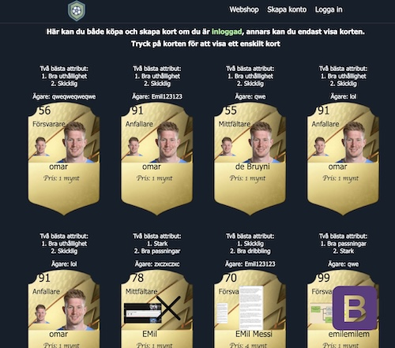
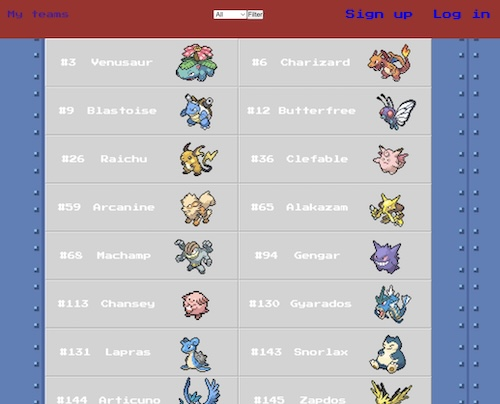
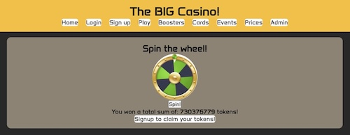

# Slutprojekt / Projekt #3 - Webbserverprogrammering 1
Enskillt slutprojekt under hela vårterminen 2025 i kursen Webbserverprogrammering 1 på NTI Johanneberg.

Under hela vårterminen kommer du att bygga en webbapplikation med de tekniker vi har lärt oss i kursen Webbserverprogrammering. Målet är att du ska få en användbar & fungerande webbapplikation.

Du får välja att bygga vad du vill så länge det är rimliga projekt. Du kan t.ex. bygga:

 - Webbshop
 - Forum
 - Rollspel
 - Gymsida
 - Blocket mini
 - Matlagningssida med recept

#### Exempel på tidigare projekt

  
*Elevexempel: Webshop*

  
*Elevexempel: Pokemon*

  
*Elevexempel: Casino*

### Uppgiftsbeskrivning & specifikation
- Webbapplikation i `Ruby` med `Sinatra` och `SQLite`. 
- Individuellt projekt
- Ta inspiration från dina tidigare projekt för att t.ex. skapa din _seeder_
- Forka [detta repot](https://github.com/ntijoh-ola-lindberg/wsp1-slutprojekt) och arbeta i för ditt projekt.
- Öppna `Issues` och `Github discussions` på [ditt Github-repository](https://docs.github.com/en/repositories/managing-your-repositorys-settings-and-features/enabling-features-for-your-repository).
- Bjud in mig: _ntijoh-ola-lindberg_
- All kod har ni på ert Github-repo
- Ni skriver i loggboken varje vecka
- Vid slutinlämning: Lämna in en liten film på classroom som visar applikationen
- Under projektet kommer vi ha genomgångar och avstämningar för fler tekniker och avstämningsuppgifter. Jag har planerat att vi gör minst sekvensdiagram och E/R diagram.
- På vägen kommer du få löpande tips för hur du kan göra koden snyggare, bättre och lättare att hantera. Främst via loggboken och Github.

### 🗒️ Projektplan

Alla skapar en projektplan som innehåller minst följande 4 punkter. Du skriver den i din loggbok. Alla bör uppdateras efter hand som projektet växer.

1. __Projektbeskrivning__ Beskriv vad applikationen ska kunna göra och vilka olika delar av applikationen som finns. Vem ska använda applikationen? Vilka tekniska lösningar använder du (frontend, backend, databas, versionshantering)? Hur hänger delarna ihop?
2. __Vyer__ Gärna blyertskisser på papper. Minst 30 min skissande.
3. __Databas__ Bild på detaljerat ER-diagram. Kan utvecklas under projektets gång men du behöver ha arbeta fram en grund här.
4. __Arkitektur__ Beskriv filer och mappar - vad gör/innehåller de? Skrivs efter hand.

### Bedömning

A-F [enligt beskrivning](https://github.com/ntijoh/WTF24/blob/main/Bed%C3%B6mning%20Webbserver%201.md)

### Lektionsplanering

| Vecka 	| Vad                                    	    |
|-------	|---------------------------------------------|
| 3     	| Övning i brainstrorming. Projektbeskrivning ca 1/2 A4 i loggboken.              |
| 4     	| Projektstart                                |
| 5     	| Arbete                                 	    |
| 6   	  | Arbete                              	      |
| 7     	| Lov                                 	      |
| 8     	| Arbete                                 	    |
| 9     	| Arbete                                 	    |
| 10     	| Arbete                                 	    |
| 11     	| Arbete                                 	    |
| 12     	| Arbete                                 	    |
| 13     	| Arbete                                 	    |
| 14    	| Arbete                                 	    |
| 15     	| Slutinlämning                               |
| 16     	| Lov                                 	      |
| 17     	| Lov                                 	      |
| 18    	| Ev. komplettering                           |
| 19      | Ev. komplettering                           |
| 20      | Betygsinfo                                  |

### Installation

- Ladda ner de biblotek (tex. `SQLite`) du behöver med `bundle` (eller `bundle install` som är samma sak)
- Starta appen med `rake dev`
- Kör seeder-filen med `rake seed`
